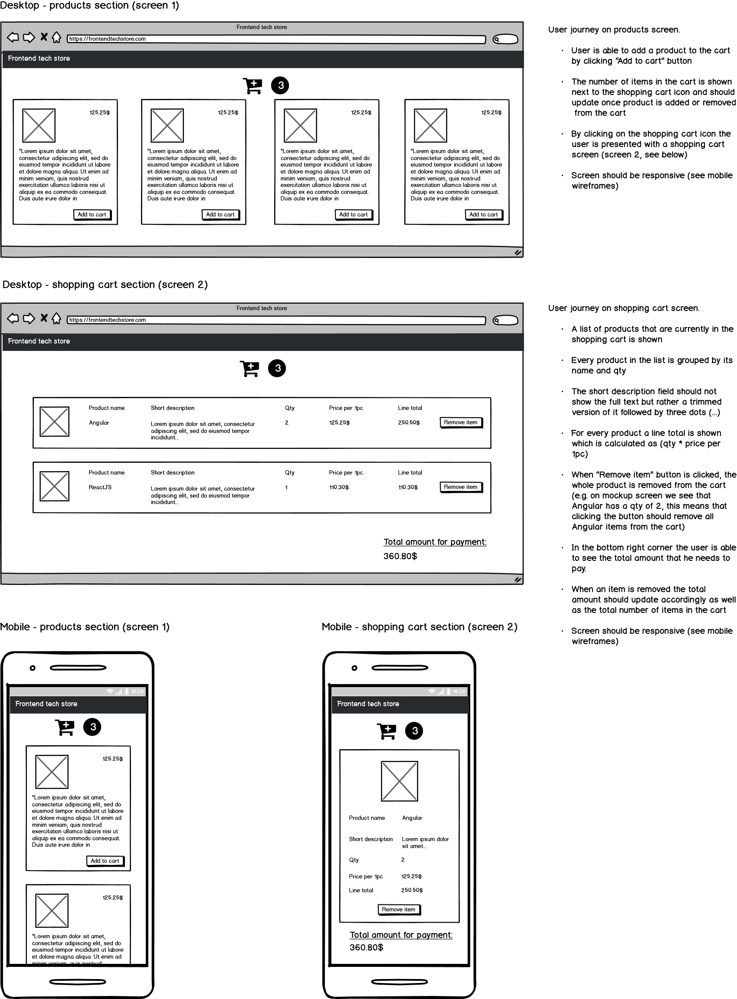

# Zuhlke frontend coding assignment

Welcome to the Frontend tech store development team!

Frontend tech store allows developers to buy best libraries and frameworks from web ecosystem and we need your support in making our online store even better. We've already gathered all requirements but some parts of our online store are still under construction and this is where you come in!

Read through the requirements and check out the wireframes. The submitted solution should cover all requirements from the below document.

The solution should be implemented with existing tools and libraries that are part of this repo and additional libraries like Redux etc. should **NOT** be installed!

For setting up your development environment, see [Getting started](#getting-started---step-by-step) section.

## Getting started - step by step

This project was bootstrapped with [Create React App](https://github.com/facebook/create-react-app).

- Install [NodeJS](https://nodejs.org/en/)
- `cd` into this folder
- Run `npm install`

## Available Scripts

In the project directory, you can run:

### `npm start`

Runs the app in the development mode. 
Open [http://localhost:3000](http://localhost:3000) to view it in the browser.

The page will reload if you make edits. 
You will also see any lint errors in the console.

### `npm test`

Launches the test runner in the interactive watch mode. 
See the section about [running tests](https://facebook.github.io/create-react-app/docs/running-tests) for more information.

### `npm run build`

Builds the app for production to the `build` folder. 
It correctly bundles React in production mode and optimizes the build for the best performance.

The build is minified and the filenames include the hashes. 
Your app is ready to be deployed!

See the section about [deployment](https://facebook.github.io/create-react-app/docs/deployment) for more information.
